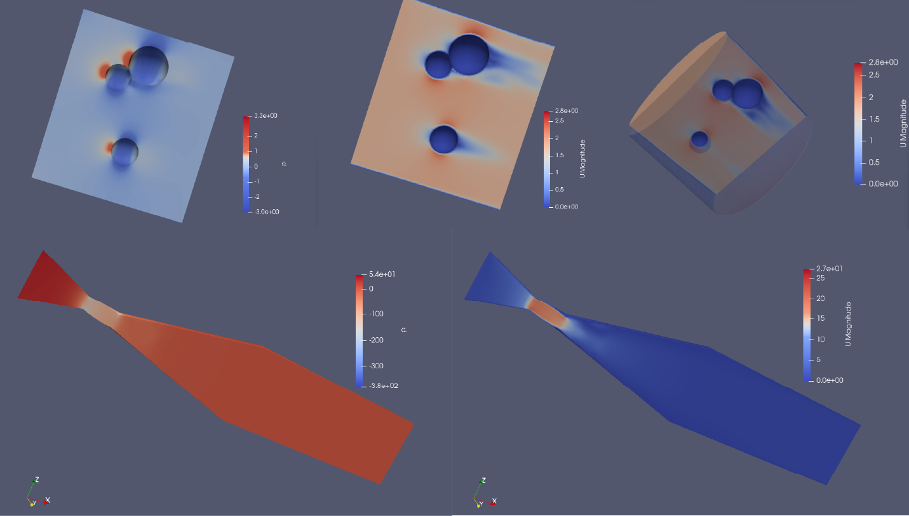

# Introducing a Comprehensive Benchmark Dataset

## What

The project focuses on creating a **standard dataset** for Computational Fluid Dynamics (CFD) research. Its purpose is to address the current lack of standardized benchmarks in CFD. It includes automated geometry creation, steady-state simulations, and diverse boundary conditions, all geared towards setting rigorous standards for CFD simulations.

    

## Dataset Specifications

- **Number of Simulations**: 1000 steady-state simulations
- **Boundary Conditions**: One inlet, one outlet, and no-slip wall conditions  
- **Geometrical Dimensions**: Lengths from 0.1 to 10 meters
- **Turbulence Model**: k-epsilon model
- **Fluid**: Air at 25 Celsius

## Creation Process

An automated workflow utilizing tools including Gmsh for geometry and mesh generation and OpenFOAM for performing simulations was implemented to generate the dataset. Scripts were written for all these tasks:

- Randomized geometries generation to construct meshes
- Mesh generation and refinement
- Setting up case files with boundary conditions  
- Running simulations to convergence criteria
- Post-processing and storing all data in VTK format

## Potential Applications  

This standardized dataset enables:

- Performance Benchmarking for CFD Algorithms
- Training models for foundational downstream tasks

## Future Work  

There are plans to expand the dataset by:

- Expanding to 10,000 geometries
- Incorporating DNS alongside the k-epsilon turbulence model  
- Diversifying geometry features and fluids

## Conclusion

This project has created a diverse, standardized dataset of 1,000 computational fluid dynamics simulations. Through procedural geometry generation and automated simulation workflows, it provides a rigorous benchmark for evaluating CFD algorithms. With plans to expand to 10,000 cases using direct numerical simulation and more geometry/fluid variations, the dataset marks an important step towards pushing CFD research forward. Its potential impact comes from enabling performance benchmarking, serving as training data, and setting a high standard for reproducibility and consistency. By tackling the lack of standardized datasets in CFD, this project lays the groundwork for impactful advancements in the field. Its release will be hugely beneficial for researchers across academia and industry.

Contact me at aseemmd@mail.uc.edu for complete dataset.